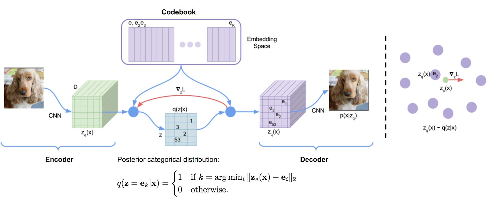
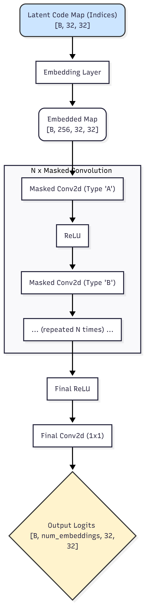
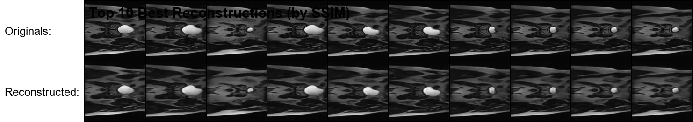
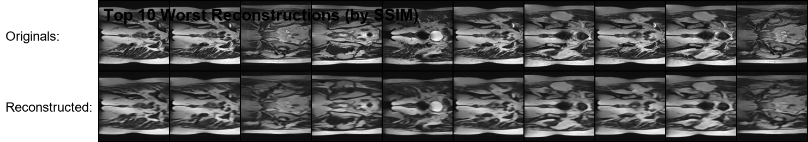
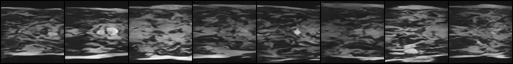

# VQ-VAE and PixelCNN for HipMRI Prostate Cancer Image Generation
**Author:** [Your Name] ([Your Student ID])

## 1. Overview

### The Problem
This project aims to solve the challenge of generating realistic medical imagery by creating a generative model for the HipMRI Study on Prostate Cancer dataset. The primary goal is to implement a two-stage model, combining a Vector-Quantized Variational Autoencoder (VQ-VAE) with a PixelCNN prior, to generate clear 2D MRI slices. The key success metric is to achieve a **Structured Similarity Index (SSIM) of over 0.65** on a held-out test set.

### How it Works
The model is a two-stage pipeline designed to first learn a "vocabulary" of visual features and then learn the "grammar" of how to arrange them.

#### Stage 1: Learning a Visual Vocabulary (VQ-VAE)
The first stage uses a **VQ-VAE**, a type of autoencoder that excels at producing sharp images by learning a discrete latent space. It has three main parts:
1.  **Encoder:** A deep convolutional neural network (CNN) that compresses an input MRI slice into a lower-dimensional latent map of feature vectors.
2.  **Vector Quantizer (Codebook):** This is the core of the VQ-VAE. It maintains a finite, learnable "codebook" (e.g., 512 vectors). For each vector from the encoder, it finds the single closest vector in the codebook and replaces it. This "quantization" step creates a discrete map of codebook indices.
3.  **Decoder:** A transposed CNN that takes the discrete latent map and reconstructs the image.

The VQ-VAE is trained to make the reconstructed image as close as possible to the original. After training, the codebook contains a rich vocabulary of all the essential visual patterns (textures, edges, shapes) found in the MRI scans.


*(Diagram sourced from Analytics Vidhya [1])*

#### Stage 2: Learning the Spatial Structure (PixelCNN)
While the VQ-VAE learns *what* to draw, it doesn't learn *how* to arrange the features coherently. This is the job of the **PixelCNN**, which acts as a powerful **prior** over the discrete latent space.
1.  **Training:** After the VQ-VAE is trained and frozen, its encoder is used to convert the entire training dataset into a set of discrete latent maps (grids of codebook indices). The PixelCNN is then trained on these maps.
2.  **Autoregression:** The PixelCNN learns to predict the next code index in a grid based on all the previous indices "above and to the left" of it. It learns the statistical patterns and spatial relationships of the visual vocabulary.



During the final generation step, the trained PixelCNN creates a completely new, structured latent map from scratch, one "pixel" (code index) at a time. This synthetic map is then passed to the VQ-VAE's decoder to produce a novel, high-quality image that respects the learned spatial patterns of the original dataset.

---

## 2. Data and Preprocessing

### Dataset
The model is trained on the **HipMRI Study on Prostate Cancer** dataset, which consists of pre-processed 2D slices stored as NIfTI files (`.nii.gz`). The dataset is divided into training, validation, and testing sets.

### Pre-processing
The following pre-processing steps are applied in `dataset.py`:
1.  **Resizing:** All images are resized to a uniform dimension of **128x128 pixels** to ensure consistent input for the model.
2.  **Normalization:** Pixel values are normalized to the range `[-1, 1]`. This is a standard practice that helps stabilize training and aids the model's convergence.

*(Reference: The normalization method is a common technique in deep learning for image data.)*

### Data Splits Justification
The dataset is pre-split into `train`, `validate`, and `test` directories. This project respects this split. The **training set** is used exclusively to train the model parameters. The **validation set** is used during training to make key decisions, such as when to save the best model and when to reduce the learning rate. Finally, the **test set** is held out and used only once at the very end in `predict.py` to provide an unbiased, final evaluation of the model's performance on completely unseen data.

---

## 3. Project Structure
The project is organized into a modular structure for clarity and maintainability.

```
/
├── diagrams/               # Folder for storing diagrams like vqvae_diagram.png
├── checkpoints/            # Directory for saved model weights
├── predictions/            # Directory for final output images
├── main.py                 # Main entry point for all operations
├── config.py               # Centralized configuration for all hyperparameters
├── modules.py              # VQ-VAE and PixelCNN model architectures
├── dataset.py              # Data loading and preprocessing pipeline
├── train.py                # The VQ-VAE training and validation loop
├── train_pixelcnn.py       # The PixelCNN training loop
├── predict.py              # Script to load models and generate final results
└── README.md               # This file
```

---

## 4. Dependencies and Reproducibility

### Dependencies
To ensure reproducibility, all required Python libraries and their versions are listed below.

| Dependency   | Version |
|--------------|---------|
| torch        | [e.g., 2.0.1] |
| torchvision  | [e.g., 0.15.2]|
| torchmetrics | [e.g., 1.0.0] |
| Pillow       | [e.g., 10.1.0]|
| nibabel      | [e.g., 5.1.0] |
| tqdm         | [e.g., 4.65.0]|
| matplotlib   | [e.g., 3.7.1] |
| numpy        | [e.g., 1.25.0]|

*(**Action:** Run `pip freeze` to get your exact versions and fill them in.)*

### Environment Setup
1.  Create a Conda or venv environment.
2.  Install the required packages:
    ```bash
    pip install torch torchvision torchmetrics Pillow nibabel tqdm matplotlib numpy
    ```

---

## 5. Usage Instructions
The project is run from the terminal in a three-step process.

### 1. Train the VQ-VAE
This learns the visual codebook.
```bash
python main.py train --local
```

### 2. Train the PixelCNN Prior
This learns the structure of the latent space.
```bash
python main.py train_pixelcnn --local
```

### 3. Generate Final Predictions and New Images
This loads both trained models to run the final evaluation and generation.
```bash
python main.py predict --local
```
The output images will be saved in the `predictions/` folder.

---

## 6. Example Inputs, Outputs, and Plots

### Training Progress
The model's performance was tracked during training. The plot below shows the training loss, validation loss, and validation SSIM over the epochs.


*(**Action:** After training, make sure this file exists and is embedded here.)*

### Final Output
The `predict.py` script produces a final, comprehensive analysis of the model's performance on the unseen test set.

**Overall Test Set SSIM:** **[Your Final SSIM Score, e.g., 0.8808]**

**Best and Worst Case Analysis:**
The script saves the top 10 best and worst reconstructions, which provides insight into the model's strengths and weaknesses.




**Final Generated Images:**
These are completely new images generated from scratch by the PixelCNN and VQ-VAE decoder.



*(**Action:** After running predict, make sure these files exist and are embedded here.)*

---
## 7. References
[1] Koo, J. (2021). *An Overview on VQ-VAE : Learning Discrete Representation Space*. Analytics Vidhya. [https://medium.com/analytics-vidhya/an-overview-on-vq-vae-learning-discrete-representation-space-8b7e56cc6337](https://medium.com/analytics-vidhya/an-overview-on-vq-vae-learning-discrete-representation-space-8b7e56cc6337)
