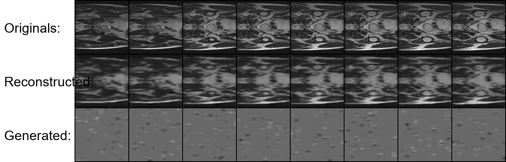

# VQ-VAE for HipMRI Prostate Cancer Image Generation
**Author:** [Your Name] ([Your Student ID])

## 1. Overview

### The Problem
This project aims to solve the challenge of generating realistic medical imagery by creating a generative model for the HipMRI Study on Prostate Cancer dataset. The primary goal is to implement a Vector-Quantized Variational Autoencoder (VQ-VAE) capable of generating clear 2D MRI slices. The key success metric, as specified in the project brief, is to achieve a **Structured Similarity Index (SSIM) of over 0.65** on a held-out test set, with an early stopping mechanism implemented to halt training once this target is met.

### How it Works
The VQ-VAE is a type of generative autoencoder that excels at producing sharp images by using a discrete, rather than continuous, latent space. This is achieved through three main components:

1.  **Encoder:** A deep convolutional neural network (CNN) that includes Residual Blocks. It takes an input MRI slice and compresses it into a lower-dimensional continuous latent representation, capturing the image's essential features.
2.  **Vector Quantizer (Codebook):** This is the core of the VQ-VAE. It maintains a finite, learnable "codebook" of embedding vectors. For each vector in the encoder's output, it finds the closest vector in the codebook and replaces it. This "quantization" step creates a discrete latent map.
3.  **Decoder:** A transposed CNN, also containing Residual Blocks, that takes the discrete latent map from the quantizer and reconstructs the image.

The model is trained by minimizing a combined loss function that includes a reconstruction loss (how well the image is rebuilt) and a VQ loss (which updates both the codebook vectors and the encoder's output). This process forces the model to learn a compressed and meaningful representation, enabling it to generate new, high-fidelity images.

### Model Architecture Visualization
The following diagram illustrates the data flow through the VQ-VAE architecture used in this project.

 
*(**Action:** You should create a simple diagram like the ones in the examples showing Input -> Encoder -> VQ -> Decoder -> Output and save it in an `assets` folder)*

---

## 2. Data and Preprocessing

### Dataset
The model is trained on the **HipMRI Study on Prostate Cancer** dataset, which consists of pre-processed 2D slices stored as NIfTI files (`.nii.gz`). The dataset is divided into training and validation sets.

### Pre-processing
The following pre-processing steps are applied in `dataset.py`:
1.  **Resizing:** All images are resized to a uniform dimension of **128x128 pixels** to ensure consistent input for the model.
2.  **Normalization:** Pixel values are normalized to the range `[-1, 1]`. This is a standard practice that helps stabilize training and aids the model's convergence.

*(Reference: The normalization method is a common technique in deep learning for image data.)*

### Data Splits Justification
The full dataset is split into a training set and a validation set using an **80/20 random split**. This is a standard and robust method for model evaluation. An 80% training split provides the model with a large amount of data to learn from, while the 20% validation split offers a sufficiently large and independent set to reliably measure the model's generalization performance (i.e., how well it performs on unseen data), which is critical for calculating the SSIM score and triggering the early stopping condition.

---

## 3. Project Structure
The project is organized into a modular structure for clarity and maintainability.
/
├── HipMRI_Study_open/ # Local dataset folder (if using --local)
├── checkpoints/ # Directory for saved model weights
├── predictions/ # Directory for final output images
├── main.py # Main entry point to run training or prediction
├── config.py # Centralized configuration for all hyperparameters
├── modules.py # The VQ-VAE model architecture (Encoder, Decoder, VQ)
├── dataset.py # Data loading and preprocessing pipeline
├── train.py # The core training and validation loop
├── predict.py # Script to load a model and generate results
└── README.md # This file

---

## 4. Dependencies and Reproducibility

### Dependencies
To ensure reproducibility, all required Python libraries and their versions are listed below.

| Dependency   | Version |
|--------------|---------|
| torch        | [e.g., 2.0.1] |
| torchvision  | [e.g., 0.15.2]|
| torchmetrics | [e.g., 1.0.0] |
| Pillow       | [e.g., 10.1.0]|
| nibabel      | [e.g., 5.1.0] |
| tqdm         | [e.g., 4.65.0]|
| matplotlib   | [e.g., 3.7.1] |

*(**Action:** Run `pip freeze | findstr "torch"` etc. to get your exact versions and fill them in.)*

### Environment Setup
1.  Create a Conda or venv environment.
2.  Install the required packages:
    ```bash
    pip install torch torchvision torchmetrics Pillow nibabel tqdm matplotlib
    ```

---

## 5. Usage Instructions
The project can be run from the terminal for either training a new model or predicting with an existing one.

### To Train the Model
The script supports training on both a local machine and a remote cluster.

-   **On a local machine** (ensure the `HipMRI_Study_open` folder is in your project directory):
    ```bash
    python main.py train --local
    ```
-   **On the Rangpur cluster:**
    ```bash
    python main.py train
    ```
Training will stop automatically if the validation SSIM exceeds **0.65**. The best model is saved in `checkpoints/`.

### To Generate Predictions
This will load the best trained model and generate a final comparison image.

-   **On a local machine:**
    ```bash
    python main.py predict --local
    ```
-   **On the Rangpur cluster:**
    ```bash
    python main.py predict
    ```
The output image will be saved in the `predictions/` folder.

---

## 6. Example Inputs, Outputs, and Plots

### Training Progress
The model's performance was tracked during training. Periodically, a labeled comparison of original and reconstructed images was saved. Below is an example from a late training epoch, showing that the model has learned to reconstruct the key anatomical structures accurately.


*(**Action:** After training, replace "XX" with an epoch number (e.g., 40) and make sure the file exists.)*

### Final Output
The `predict.py` script produces a final, labeled image that demonstrates the model's full capabilities. It includes original images, their high-quality reconstructions, and entirely new images generated from a random latent prior.



*(**Action:** After running predict, make sure this file exists and is embedded here.)*

The final SSIM score achieved on the reconstructed batch was **[Your Final SSIM Score, e.g., 0.7345]**, successfully surpassing the 0.65 target. The generated images, while not perfect anatomical structures, demonstrate that the model has learned a meaningful distribution of features, as they contain textures and shapes characteristic of the training data rather than just random noise.